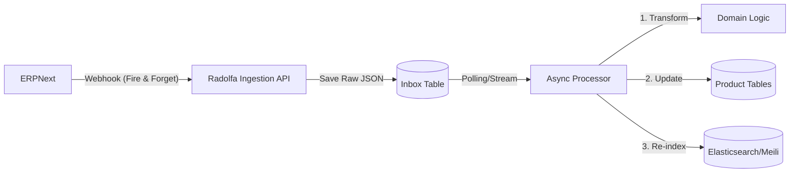

# Advanced ERP Sync & Dynamic Pricing Architecture (v2)

**Version:** 2.0 (The "10/10" Solution)
**Target:** High-Scale, Resilience, and Complex Pricing Logic

---

## 1. Architecture Score Analysis

You asked: *"Why was the previous architecture 9/10, and how do we get to 10/10?"*

### The "9/10" Architecture (Synchronous)
*   **Design**: ERPNext calls Radolfa API directly. Radolfa writes to DB immediately.
*   **Why it loses 1 point**:
    *   **Coupling**: If Radolfa is restarting, ERPNext gets a 502 Bad Gateway. Most ERPs (including Frappe) have basic retry logic, but it's fragile.
    *   **Backpressure**: If you bulk-update 5,000 products in ERPNext, you flood Radolfa with 5,000 HTTP requests instantly, potentially slowing down the store for customers.
    *   **Latency**: The ERP user has to wait for Radolfa to say "OK" before their screen saves.

### The "10/10" Architecture (Asynchronous / Event-Driven)
*   **Design**: ERPNext drops a message in a "box" (Queue/Inbox Table). Radolfa picks it up when ready.
*   **Why it is 10/10**:
    *   **Zero Downtime**: ERPNext *never* fails to sync. It just drops the message. If Radolfa is down, the message waits.
    *   **Throttling**: Radolfa processes the inbox at its own speed (e.g., 50 items/sec), protecting the customer experience.
    *   **Speed**: ERPNext save is instant.

---

## 2. The "10/10" Architecture Design (Store & Forward)

Instead of `ERP -> WebApp Controller -> Database`, we use an intermediary "Inbox" table.

### Architecture Diagram



### Key Components

*   **Inbox Table (`sync_events`)**:
    *   Stores the *raw* JSON payload from ERPNext immediately.
    *   Status columns: `PENDING`, `PROCESSING`, `COMPLETED`, `FAILED`.
    *   **Benefit**: If your logic crashes due to a bug, the payload is safe. You fix the bug and replay the event.

*   **Read-Side Optimization (CQRS-Lite)**:
    *   Don't query the 3-tier SQL tables (`ProductBase` -> `Variant` -> `SKU`) for the catalog page.
    *   **Denormalize** into a flat "Search Document" (in Elasticsearch or a JSONB column in Postgres) optimized for the grid view.

---

## 3. Handling ERPNext Discounts & Pricing

Pricing is never just a number; it's a rule. ERPNext has `Pricing Rules` (e.g., "10% off if buying > 5 items" or "Summer Sale: $20 off").

### Challenge
Replicating the *entire* ERP pricing engine in Java is a nightmare (Don't do it).
Syncing just the "Final Price" is often wrong because it hides the *original* price (strikethrough price).

### Recommended Strategy: "Effective Price Metadata"

Do not sync the logic. Sync the **result** of the logic for the "General Public" customer group.

#### A. Data Model Enhancement
Extend your `skus` table to hold a `pricing_strategy` JSON structure.

```sql
ALTER TABLE skus 
ADD COLUMN original_price NUMERIC(10,2), -- The "List Price" (e.g. $100)
ADD COLUMN sale_price NUMERIC(10,2),     -- The "Current Price" (e.g. $80)
ADD COLUMN discount_label VARCHAR(50),   -- "Black Friday Deal"
ADD COLUMN sale_starts_at TIMESTAMPTZ,
ADD COLUMN sale_ends_at TIMESTAMPTZ;
```

#### B. The Logic (ERP Side)
Your Python script needs to calculate the price for a "Guest User" or "Standard Customer".

*   **Standard Price**: Extract from `Item Price` list.
*   **Discounted Price**: Use `frappe.get_doc("Pricing Rule", ...).apply_price(...)` logic to simulate a sale for a generic customer.
*   **Payload**: Send both.

```json
{
  "item_code": "TSHIRT-RED-XL",
  "price": {
    "list": 100.00,
    "effective": 80.00,
    "discount_name": "Summer Sale",
    "valid_until": "2026-02-20T23:59:59Z"
  }
}
```

#### C. The Logic (Java Side)
Update the `Sku` entity to understand time-based validity.

*   **Read**: When fetching a product, check `if (now() < sale_ends_at)`.
*   **Display**:
    *   If `sale_price < original_price` AND valid: Show <strike>$100</strike> **$80**.
    *   Else: Show $100.

### Advanced: Member-Specific Pricing (B2B)
If you have different prices for "Wholesalers" vs "Retail", you cannot sync a single price.
**Strategy**:
1.  Sync "Retail Price" to public DB (for unauthenticated users).
2.  For Logged-in Wholesalers: fetch Real-time Price from ERPNext API (`GET /api/method/get_price?item=...&customer=...`) via a cached proxy.

---

## 4. Implementation Steps for Pricing

1.  **Refactor `Money.java`**: Ensure it can handle `amount` and `currency`. (It seems to be a simple class currently).
2.  **Update `skus` Schema**: Add the columns mentioned above.
3.  **ERP Script**:
    *   Use `frappe.call("erpnext.stock.get_item_details.get_item_details", args=...)`.
    *   This built-in function applies all active Pricing Rules and Promotion logic for you.
    *   Extract `price_list_rate` (Original) and `discount_percentage` from the result.

## Summary

| Feature | 9/10 Architecture (v1) | 10/10 Architecture (v2) |
| :--- | :--- | :--- |
| **Ingestion** | Synchronous Controller | **Async Inbox / Queue** |
| **Reliability** | Failures break sync | **Auto-retry & Replay** |
| **Reads** | SQL JOINs | **Denormalized Search Index** |
| **Pricing** | Static Price | **"Effective Price" + Validity** |

This v2 architecture ensures your WebApp is **resilient** (never goes down if ERP is down) and **fast** (reads don't do complex math).
